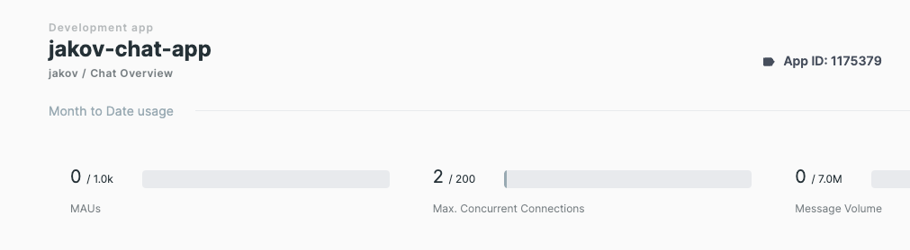
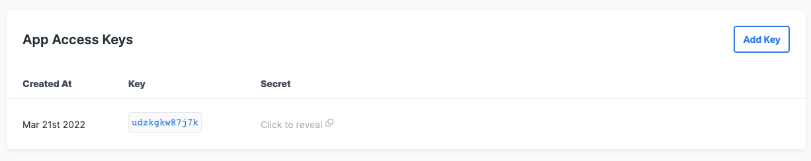
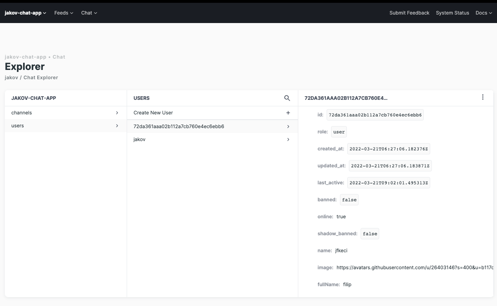

# Stream chat implementation


```bash
npm install
```

### 1. Create a new app on getstream



With the app you get a new STREAM_APP_ID


Also you get an STREAM_API_KEY and STREAM_API_SECRET




### 2. Creating a new Stream Chat user example

```javascript
import { Types } from 'mongoose';
import bcrypt from 'bcrypt';
import connect from 'getstream';
import StreamChat from 'stream-chat';

const api_key = process.env.STREAM_API_KEY;
const api_secret = process.env.STREAM_API_SECRET;
const app_id = process.env.STREAM_APP_ID;

async register (dto: CreateNewChatUserDTO) {
    const { fullName, username, password, phoneNumber } = dto;

    const userId = new Types.ObjectId();

    const serverClient = connect(api_key, api_secret, app_id);

    const hashedPassword = await bcrypt.hash(password, 10);

    const token = serverClient.createUserToken(userId);

    return { token };
};
```

This creates a new Stream Chat user and a token that can be used with Stream Chat client app




### 2. Stream Chat user login example

```javascript
async login (dto: LoginUserDTO){
        const { username, password } = dto;

        const serverClient = connect(api_key, api_secret, app_id);

        const client = StreamChat.getInstance(api_key, api_secret);

        const { users } = await client.queryUsers({ name: username });

        if (!users.length) throw new ConflictException('Invalid credentials');

        const success = await bcrypt.compare(password, users[0].hashedPassword);

        const token = serverClient.createUserToken(users[0].id);

        if (success) return { token }; 
        
        throw new ConflictException('Invalid credentials');
}
```

This check if the user exists in getstream app db and returns a token that can be used with Stream Chat client app


